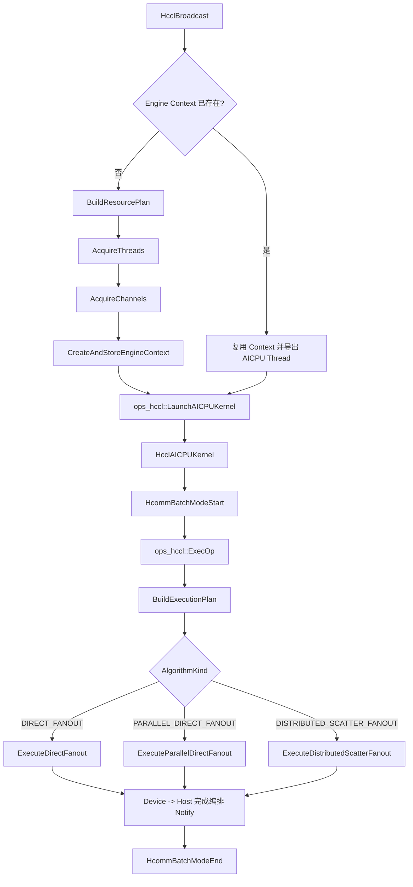

# HCCL Broadcast 当前实现总览

## 分析快照

- [确认] 分支：`main`。
- [确认] Commit：`8febb7c189d4cecdf30f4b50bd63b3436925c820`（`perf: parallelize medium broadcast fanout`）。
- [确认] 开始分析时工作区已有未提交修改：`docs/prompt.md` 为删除状态，`docs/HCCL-current-implementation-analysis-prompt.md` 为未跟踪文件；它们不是本文档生成过程造成的。生成本文档后，`docs/current-implementation/` 也属于未提交内容。
- [确认] 本次只分析当前工作树中的源码，没有修改 `hccl_broadcast_problem_template/` 下的任何源文件。

## 实现了什么

[确认] 对外只实现 `HcclBroadcast`，语义是把 `root` 的原地用户 Buffer 广播到同一通信域的其他 rank。当前 `SIZE_TABLE` 只包含 `HCCL_DATA_TYPE_FP32`。

代码根据 `totalBytes = count * elementSize` 和资源条件选择三条路径：

| 数据量/条件 | 算法 | 实际拓扑 | 入口 |
|---|---|---|---|
| `< 64 KiB`，或其他算法资源检查失败 | `DIRECT_FANOUT` | root 星形串行扇出；必要时分块 | `ExecuteDirectFanout` |
| `64 KiB <= bytes <= 1 MiB`，整包能放入共同 HCCL Buffer，且 worker 资源完整 | `PARALLEL_DIRECT_FANOUT` | root 星形扇出；root 的各 Channel worker 并行 | `ExecuteParallelDirectFanout` |
| `> 1 MiB`，全连接 Channel、每 peer 唯一 worker、双窗口 Notify 和最小 Tile 容量均满足 | `DISTRIBUTED_SCATTER_FANOUT` | root 先按 owner 分片；每个非 root owner 再向其他非 root rank 全互换/扇出 | `ExecuteDistributedScatterFanout` |

依据：

- 文件：`hccl_broadcast_problem_template/op_kernel_aicpu/exec_op.cc`
- 符号：`AlgorithmKind`、`AlgorithmConfig`、`BuildExecutionPlan`、`ops_hccl::ExecOp`
- 关键变量：`kParallelDirectMinBytes`、`kParallelDirectMaxBytes`、`plan.algorithm`
- 行号：L18-L47、L260-L335、L849-L869

[确认] Host 为每个本地 rank 建立到其余所有 rank 的 Channel，形成全连接逻辑资源图；每条 Channel 使用 `HcclRankGraphGetLinks` 返回的前三层中第一个非 `COMM_PROTOCOL_RESERVED` Link。代码没有按“同 Server/跨 Server”显式分支，2 Server × 8 NPU 只来自题目和测试配置，不是算法中的硬编码拓扑。

## 四层职责

| 层 | [确认] 当前职责 | 代码依据 |
|---|---|---|
| Host | 校验参数；取得 rank；申请/复用 Thread、Channel、HCCL Buffer 和 Engine Context；在用户 stream 上启动 AICPU Kernel | 文件：`op_host/broadcast.cc`；符号：`HcclBroadcast`、`AcquireThreads`、`AcquireChannels`、`CreateAndStoreEngineContext` |
| Kernel 启动层 | 加载 `HcclAICPUKernel` 二进制；建立 Host stream 与 AICPU 主线程的启动/完成 Notify；下发一个 block | 文件：`op_host/launch_aicpu_kernel.cc`；符号：`LoadAICPUKernel`、`ops_hccl::LaunchAICPUKernel` |
| AI CPU | 反序列化静态资源、开启 BatchMode、生成执行计划，并把 LocalCopy、Write、Fence、Notify 等任务编排到主线程和 worker 线程 | 文件：`op_kernel_aicpu/aicpu_kernel.cc`、`op_kernel_aicpu/exec_op.cc`；符号：`HcclAICPUKernel`、`ops_hccl::ExecOp` |
| CCU | [待确认] 仓库没有 CCU Kernel、CCU 入口或硬件任务实现。代码只提交 HCOMM Channel 原语；其后是否以及如何由 CCU 执行，需要 CANN/HCOMM 实现或运行时任务图才能确认 | 代码中仅能看到 `HcommWriteOnThread`、`HcommChannelFenceOnThread` 等接口调用 |

## Tile、Window、Slot、Thread、Notify 与流水关系

- [确认] `Tile` 是连续用户数据片段，长度为 `tile.bytes`；Distributed 中 Tile 按 `globalTileIndex % ownerCount` 轮转给非 root owner。
- [确认] `Window` 是 `windowIndex = stripeIndex % pipelineDepth`。当前 Host 申请 `pipelineDepth=2`，执行计划再限制到最多 2。
- [确认] 源码没有独立名为 `Slot` 的结构体；分析中的 Slot 是 HCCL Buffer 内的地址槽：`slotIndex = windowIndex * ownerCount + ownerIndex`，`slotOffset = slotIndex * tileBytes`。
- [确认] 16 rank 时申请 1 个 AICPU 主线程和 15 个 Channel worker。`threads[0]` 是主线程，`threads[1..15]` 与本 rank 的 15 条 Channel 一一对应。
- [确认] 每条 Channel 申请 4 个 Notify：窗口 0/1 的 `DATA_READY` 为 0/1，窗口 0/1 的 `SLOT_CONSUMED` 为 2/3。
- [确认] 每个 Thread 申请 `pipelineDepth * (workerCount + 1) + 1` 个 Notify；16 rank 时为 33 个。索引按目标 ThreadHandle 隔离，因此相同数字在不同线程上不是同一个信号槽。
- [确认] 窗口复用不是由计数器自动判定：root-owner Channel 在下一批复用前等待最终 `SLOT_CONSUMED`；owner-peer Channel 在每次发送末尾等待对应 `SLOT_CONSUMED`；coordinator 在下一批前等待所有 peer worker 的 window 完成信号。

## 总体流程

[确认] `LaunchAICPUKernel` 等待的是 AICPU 侧“通信任务编排完成”的 Notify；仓库没有 `aclrtSynchronizeStream`。因此 `HcclBroadcast` 的 Host 返回遵循 stream 异步语义，不能解释成 CPU 已同步等到所有数据搬运结束。

## 推荐阅读顺序

1. 本文件：先建立三档算法和四层职责的整体视图。
2. `01-architecture.md`：理解冷/热路径、rank 角色和调用链。
3. 文件：`hccl_broadcast_problem_template/include/common.h`；符号：`OpParam`、`SIZE_TABLE`。
4. 文件：`hccl_broadcast_problem_template/include/custom.h`；符号：`ChannelInfo`、`AlgResourceCtx`。
5. `02-resource-and-data-path.md`：理解 Tile/Window/Slot 公式和真实数据路径。
6. `03-signal-path.md`：逐项核对 Notify 的生产者、消费者和复用条件。
7. 文件：`hccl_broadcast_problem_template/op_host/broadcast.cc`；按 `HcclBroadcast -> BuildResourcePlan -> AcquireThreads/AcquireChannels` 阅读。
8. 文件：`hccl_broadcast_problem_template/op_kernel_aicpu/exec_op.cc`；按 `BuildExecutionPlan -> MakeTileDesc/GetSlotAddress -> 三个 Execute 入口` 阅读。
9. `04-code-map.md`、`05-execution-trace.md`：把功能映射回函数，并用 16-rank 尾块用例走一遍。
10. `06-invariants-and-questions.md`：最后查看已保证条件、风险和待确认项。
